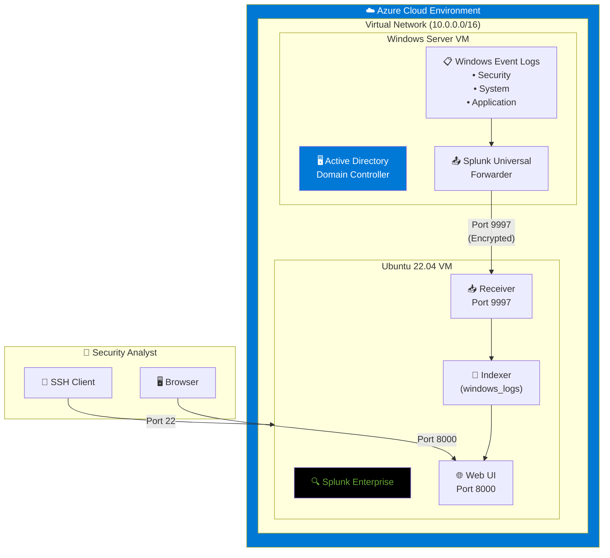

# Lab 3: Splunk SIEM & Log Analysis


> **A hands-on SIEM deployment lab demonstrating log collection, security monitoring, and threat detection using Splunk Enterprise on Azure infrastructure.**

---

## 📋 Overview

This lab simulates a real-world Security Operations Center (SOC) environment by deploying Splunk Enterprise to collect, index, and analyze Windows Security logs from an Active Directory domain controller. The project demonstrates core SIEM concepts that are foundational to security operations roles.

| Field | Details |
|-------|---------|
| **Certification Alignment** | CompTIA Security+ · CySA+ · Splunk Core Certified User |
| **Tools Used** | Splunk Enterprise (Free License) · Azure VMs · Universal Forwarder |
| **Time to Complete** | 4–6 hours |
| **Cost** | $0 (Splunk Free License: 500MB/day) |
| **Career Relevance** | SOC Analyst (Tier 1–3) · Security Engineer · Incident Responder |

---

## 🏗️ Architecture



### Data Flow Summary

1. **Windows Server VM** generates security events (logins, failures, lockouts)
2. **Universal Forwarder** monitors Windows Event Logs and forwards to Splunk
3. **Splunk Indexer** receives data on port 9997 and stores in `windows_logs` index
4. **Security Analyst** queries and visualizes data through the Splunk Web UI

---

## 🎯 Skills Demonstrated

| Skill | Real-World Application |
|-------|------------------------|
| **Splunk Deployment & Configuration** | Enterprise SIEM deployment and data input configuration |
| **SPL (Splunk Processing Language)** | Query language used in SOC investigations and threat hunting |
| **Log Analysis** | Identifying failed logins, brute force attempts, and account lockouts |
| **Security Dashboard Creation** | Building operational visibility for security monitoring |
| **Alert Engineering** | Automated detection rules for suspicious activity |
| **Windows Security Events** | Understanding EventCodes 4624, 4625, 4740 |

---

## 🔧 Infrastructure Setup

### Azure VM Specifications

| Component | Splunk Server | Windows Server |
|-----------|---------------|----------------|
| **OS** | Ubuntu 22.04 LTS | Windows Server 2022 |
| **Size** | Standard_B2s (2 vCPU, 4GB RAM) | Standard_B2s |
| **Disk** | 30GB | 30GB |
| **Role** | SIEM / Indexer | AD Domain Controller |

### Network Security Group Rules

| Port | Service | Access Scope |
|------|---------|--------------|
| 22 | SSH | My IP only |
| 8000 | Splunk Web UI | My IP only |
| 9997 | Forwarder Input | VNet only (10.0.0.0/16) |

---

## 📊 Key SPL Queries

### Detect Failed Login Attempts (Brute Force Indicator)
```spl
index=windows_logs sourcetype=WinEventLog:Security EventCode=4625
| stats count by Account_Name, Workstation_Name
| sort -count
```
> **Use Case:** Identifies potential brute force attacks. 5+ failures for one account in a short window warrants investigation.

### Monitor Successful Logins by Type
```spl
index=windows_logs sourcetype=WinEventLog:Security EventCode=4624
| stats count by Account_Name, Logon_Type
| sort -count
```
> **Logon Types:** 2=Interactive, 3=Network, 5=Service, 10=RDP

### Track Account Lockouts
```spl
index=windows_logs sourcetype=WinEventLog:Security EventCode=4740
| table _time, Account_Name, Caller_Computer_Name
| sort -_time
```
> **Use Case:** Multiple lockouts indicate password spray attacks.

### Detect After-Hours Logins (Anomaly Detection)
```spl
index=windows_logs sourcetype=WinEventLog:Security EventCode=4624
| eval hour=strftime(_time, "%H")
| where hour < 7 OR hour > 19
| table _time, Account_Name, Workstation_Name, Logon_Type
| sort -_time
```
> **Use Case:** Interactive logins (Type 2/10) outside business hours may indicate compromise.

### Top 10 Failed Accounts — Threat Hunting
```spl
index=windows_logs sourcetype=WinEventLog:Security EventCode=4625 earliest=-24h
| stats count as failures by Account_Name
| sort -failures
| head 10
```
> **Use Case:** Accounts with 20+ failures in 24 hours or non-existent usernames indicate enumeration attacks.

---

## 📈 Security Dashboard

Built a **Windows Security Overview** dashboard with 4 panels:

| Panel | Visualization | Purpose |
|-------|---------------|---------|
| **Failed Logins — Last 24h** | Bar Chart | Identify accounts under attack |
| **Account Lockouts — Last 7d** | Events List | Track lockout patterns |
| **Login Activity Over Time** | Line Chart | Baseline normal activity |
| **Top Source IPs — After Hours** | Column Chart | Detect anomalous access patterns |


*Replace with your actual dashboard screenshot*

---

## 🚨 Automated Alert: Brute Force Detection

Configured a scheduled alert to detect potential brute force attacks:

```spl
index=windows_logs sourcetype=WinEventLog:Security EventCode=4625
| stats count as failures by Account_Name
| where failures > 10
```

| Setting | Value |
|---------|-------|
| **Alert Name** | Potential Brute Force — High Failure Count |
| **Schedule** | Every 15 minutes |
| **Trigger** | Number of Results > 0 |
| **Action** | Add to Triggered Alerts |

> **Tuning Note:** The threshold of 10 failures is a starting point. In production, tune based on false positive rates and environment baseline.

---

## 📁 Configuration Files

### inputs.conf (Universal Forwarder)
**Location:** `C:\Program Files\SplunkUniversalForwarder\etc\system\local\inputs.conf`

```ini
[WinEventLog://Security]
disabled = 0
start_from = oldest
current_only = 0
evt_resolve_ad_obj = 1

[WinEventLog://System]
disabled = 0

[WinEventLog://Application]
disabled = 0
```

---

## ✅ Verification Checklist

- [x] Data flowing into Splunk (`index=windows_logs | head 10` returns events)
- [x] Failed login search returns results (EventCode=4625)
- [x] Dashboard panels populated with data
- [x] Alert configured and enabled
- [x] Universal Forwarder service running on Windows VM

---

## 🔑 Key Takeaways

1. **SIEM Fundamentals:** Learned the core architecture of log collection → indexing → search → visualization
2. **SPL Proficiency:** Built practical queries that translate directly to SOC analyst workflows
3. **Detection Engineering:** Created an automated alert that mimics real-world threat detection
4. **Windows Security Events:** Mastered the critical EventCodes (4624, 4625, 4740) used in security investigations

---

## 🔗 Related Labs

| Lab | Description |
|-----|-------------|
| [Lab 1: Active Directory](../lab1-active-directory) | Windows Server + AD DS setup (prerequisite) |
| [Lab 2: Azure Sentinel](../lab2-azure-sentinel) | Cloud-native SIEM comparison |
| [Lab 4: Threat Hunting](../lab4-threat-hunting) | Advanced SPL and IOC detection |

---

## 📚 Resources

- [Splunk Documentation](https://docs.splunk.com/)
- [Splunk SPL Reference](https://docs.splunk.com/Documentation/Splunk/latest/SearchReference)
- [Windows Security Event IDs](https://docs.microsoft.com/en-us/windows/security/threat-protection/auditing/audit-logon)
- [MITRE ATT&CK — Brute Force](https://attack.mitre.org/techniques/T1110/)

---

## 📝 License

This project is for educational purposes. Splunk Enterprise is used under the free license (500MB/day limit).

---

<p align="center">
  <b>Built as part of my Cloud Security Home Lab Series</b><br>
  <a href="https://github.com/yourusername">GitHub</a> · 
  <a href="https://linkedin.com/in/yourprofile">LinkedIn</a>
</p>
